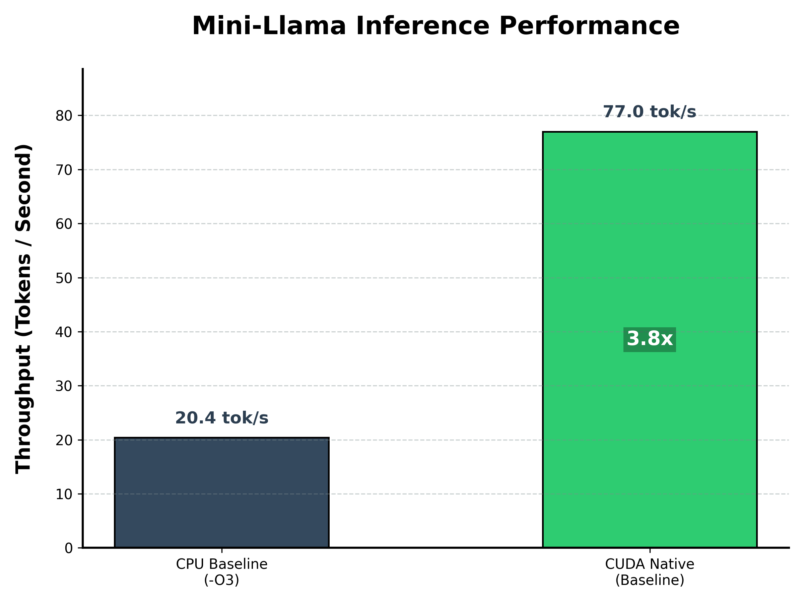

# 🚀 Mini-Llama Inference Engine


A minimal, pure C++ and CUDA-accelerated inference engine for the Llama 2 architecture. Built entirely from scratch without heavily abstracted deep learning frameworks (like PyTorch or TensorFlow) to deeply explore AI infrastructure, memory hierarchy, and parallel computing optimization at the hardware level.

## ⚡ Performance Benchmark

The engine has been mathematically aligned (strict Greedy Decoding) to ensure identical output between CPU and GPU implementations. Tested on a **110M parameter** model (Dim: 768, Layers: 12) generating a 226-token sequence.



| Architecture | Precision | Hardware | Speed (tok/s) | Time (s) | Speedup |
| :--- | :---: | :--- | :--- | :--- | :--- |
| **CPU Baseline** (`-O3`) | FP32 | Host CPU | ~ 20.41 | 11.07 | 1.0x |
| **CUDA Baseline** (Native) | FP32 | **NVIDIA RTX 4060** | **~ 77.02** | **2.93** | **🚀 3.77x** |

*(Note: The CUDA version demonstrates a nearly 4x throughput increase solely through native kernel parallelization, prior to advanced Shared Memory tiling or Tensor Core utilization.)*

## 🧠 Core Features

* **Zero Dependencies**: Written in pure C++ and CUDA. No libtorch, no ONNX, no external heavy AI frameworks.
* **Custom CUDA Kernels**: Hand-written parallel kernels for:
    * Matrix Multiplication (Matmul)
    * Root Mean Square Normalization (RMSNorm)
    * Rotary Positional Embedding (RoPE)
    * Self-Attention Mechanism (QKV projections, Softmax, Value aggregation)
* **VRAM Memory Pool**: Efficient pre-allocation of GPU memory and continuous Device-to-Device (D2D) operations to minimize Host-to-Device (H2D) PCIe bandwidth bottlenecks.
* **Industrial-Grade Sampler**: Implements Temperature Scaling and Top-P (Nucleus) Sampling on the CPU to ensure coherent and creative autoregressive generation.

## 🛠️ Quick Start

### 1. Requirements
* A C++ compiler (e.g., GCC or MSVC)
* NVIDIA GPU with CUDA Toolkit installed (`nvcc`)
* Llama-2 architecture model weights in `.bin` format (e.g., Andrej Karpathy's `stories110M.bin`).

### 2. Build & Run

**To build the CPU version:**
```bash
g++ src/main.cpp src/model_cpu.cpp src/tokenizer.cpp -o build/mini_llama_cpu.exe -O3 
```
**To build the GPU (CUDA) version:**
```bash
nvcc src/main_cuda.cpp src/model_cuda_basic.cu src/tokenizer.cpp -o build/mini_llama_cuda.exe -O3
```
**Run the engines**
```bash
./build/mini_llama_cuda.exe
./build/mini_llama_cpu.exe
```

## 🗺️ Roadmap & Future Optimizations
- [ ] Implement Shared Memory Tiling for `matmul_kernel` to overcome memory bandwidth limits.
- [ ] Integrate INT8 / INT4 Quantization to reduce memory footprint.
- [ ] Operator Fusion (Kernel Fusion) for RMSNorm and Add operations.
- [ ] Port to larger Instruction-Tuned models (e.g., TinyLlama-1.1B-Chat).

## 🙏 Acknowledgments
Inspired by the Llama architecture by Meta and the minimalist C implementation `llama2.c` by Andrej Karpathy.