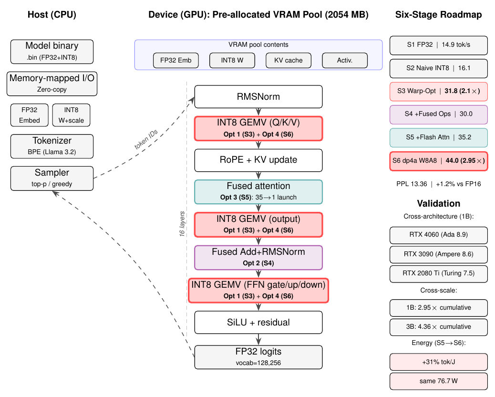
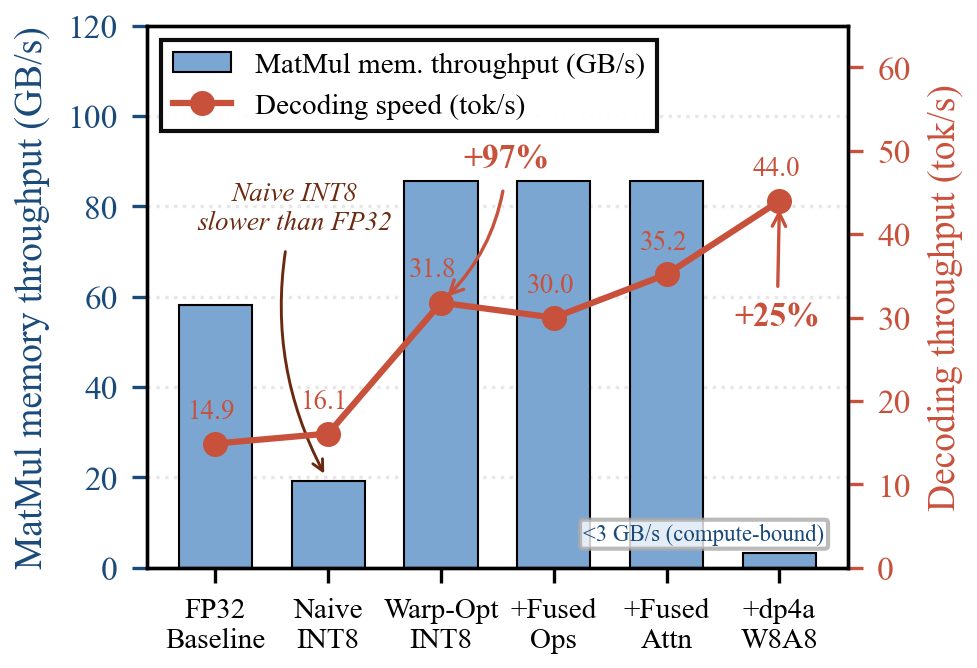
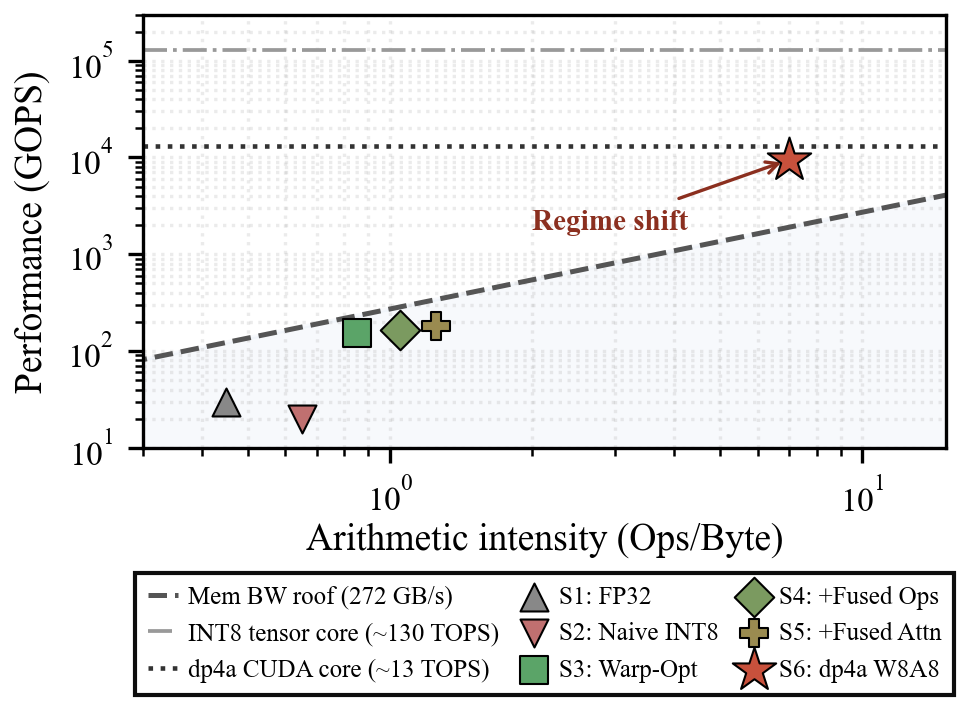
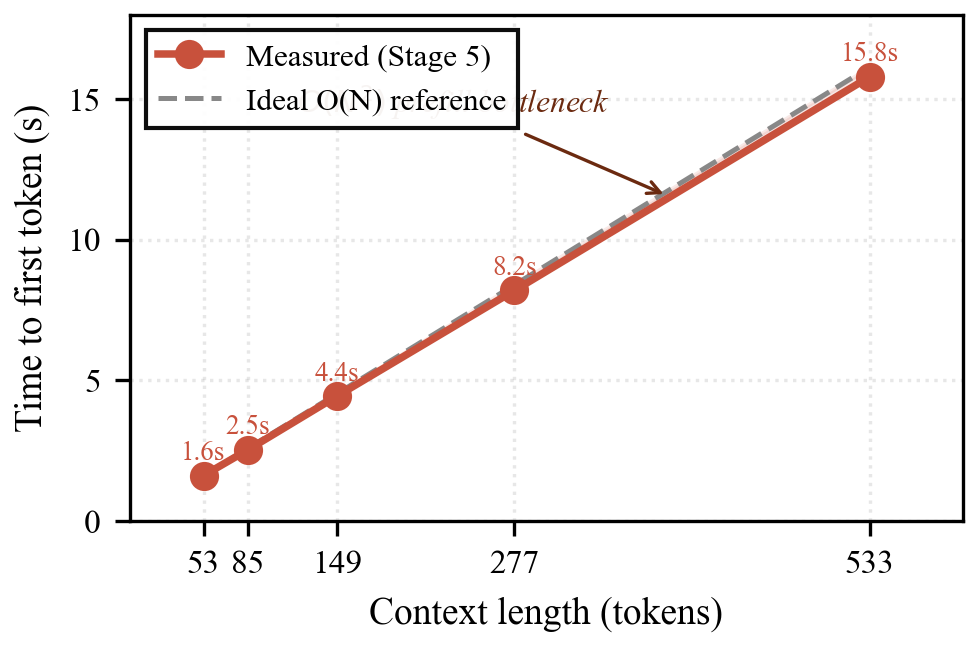
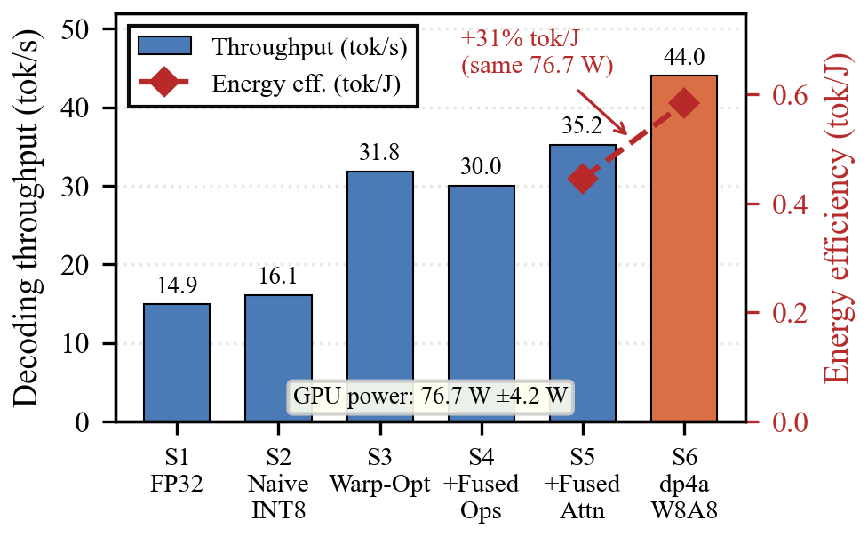

# MiniLlama-Infra

A from-scratch CUDA/C++ inference engine for **Llama-3.2-1B** on consumer GPUs, built as a
**six-stage micro-architecture ablation framework** for edge LLM deployment.

> **Paper:** *MiniLlama-Infra: A Micro-Architecture Ablation Study of Edge LLM Inference on Consumer GPUs*  
> Anonymous submission — artifact available upon acceptance.

---

## System Architecture



The engine implements the full Llama-3.2 transformer (16 layers, d=2048) from scratch in CUDA,
with a pre-allocated 2054 MB VRAM pool and memory-mapped weight loading (zero-copy, cross-platform).
Four targeted optimizations are highlighted: warp-level cooperative GEMV (S3),
fused Add+RMSNorm (S4), fused attention (S5), and dp4a W8A8 quantization (S6).

---

## Six-Stage Ablation (RTX 4060 Laptop, Llama-3.2-1B)

| Stage | Description | Tok/s | Cumul. Speedup | MatMul Mem BW | Occupancy |
|-------|-------------|------:|:--------------:|:-------------:|:---------:|
| S1 | FP32 baseline | 14.9 | 1.00× | 58.1 GB/s | 16.6% |
| S2 | Naive INT8 | 16.1 | 1.08× | **19.2 GB/s** ↓ | 16.6% |
| S3 | Warp-Opt INT8 | 31.8 | 2.13× | 85.6 GB/s | **86.8%** |
| S4 | + Fused Add+RMSNorm | 30.0 | 2.01× | 85.6 GB/s | 75.1% |
| S5 | + Fused Attention | 35.2 | 2.36× | 85.6 GB/s | — |
| S6 | + dp4a W8A8 | **44.0** | **2.95×** | 3.2 GB/s (compute-bound) | 86.84% |

**WikiText-2 PPL (stride=2048):** FP16 13.20 → W8A32 13.22 (+0.15%) → W8A8 13.36 (+1.23%)  
**Energy efficiency (76.7 W GPU):** S5 → 0.446 tok/J, S6 → **0.584 tok/J (+31%)**

> **Key counterintuitive result:** S2 (Naive INT8) collapses memory throughput 58.1→19.2 GB/s (−67%)
> *despite* 4× smaller data — L2 hit rate drops to 2.63%. Zero net speedup. The fix (S3) is a
> kernel restructuring, not more quantization.

---

## Figures

| Memory Wall Ablation | Roofline Model |
|:---:|:---:|
|  |  |

| Context Scaling | Energy Efficiency |
|:---:|:---:|
|  |  |

Figures are reproducible from `profiling_data/*.csv` via `scripts/plot_paper_figs.py` and the individual figure scripts.

---

## Key Findings

**Finding 1 — The Naive INT8 Trap:**  
Replacing FP32 weights with INT8 *without* changing the kernel layout makes things **worse**:
memory throughput drops 58.1→19.2 GB/s (−67%) due to uncoalesced warp access.
L2 hit rate collapses to 2.63%, L1 hit rate paradoxically *rises* to 96.8% (false locality).
Zero net speedup despite 4× smaller data.

**Finding 2 — Warp-Level Cooperation is the Critical Enabler:**  
Restructuring the kernel so 32 threads cooperatively compute one output row
(coalesced loads + `__shfl_down_sync` warp reduce) delivers a **5.7× kernel speedup** (298.5→52.3 µs),
restoring occupancy 16.6%→86.8% and doubling end-to-end throughput 15→31.8 tok/s.

**Finding 3 — Fusion Regression After Coalescing (S4):**  
Once memory access is coalesced, the system is GEMV-compute-bound.
Fusing non-GEMV kernels (Add+RMSNorm) adds synchronization overhead without relieving the
dominant bottleneck — throughput *regresses* from 31.8→30.0 tok/s (0.94×).
Takeaway: always optimize the dominant bottleneck first.

**Finding 4 — dp4a Regime Shift (S6):**  
`__dp4a` W8A8 quantization (per-token dynamic activations + per-group static weights)
shifts the GEMV kernel from memory-bandwidth-bound to compute-bound:
IPC 1.43→2.08, memory BW utilization 31.5%→1.19%.
Further **+25% throughput** (35.2→44.0 tok/s) at the same 76.7 W GPU power,
improving energy efficiency by **31%** (0.446→0.584 tok/J).

---

## Cross-Architecture Validation

The warp-level optimization generalizes across three GPU generations:

| GPU | Architecture | SM | S2→S3 E2E Speedup | S6 dp4a W8A8 |
|-----|-------------|-----|:-----------------:|:------------:|
| RTX 4060 Laptop | Ada Lovelace | 8.9 | 1.97× | 44.0 tok/s |
| RTX 3090 | Ampere | 8.6 | 3.46× | — |
| RTX 2080 Ti | Turing | 7.5 | 3.51× | — |

Qualitative trends (throughput uplift, occupancy recovery) are fully consistent
across all three architectures. Higher-bandwidth GPUs benefit *more* from coalescing.

---

## 3B Model Validation (RTX 3090, Llama-3.2-3B)

| Stage | Tok/s | Cumul. Speedup |
|-------|------:|:--------------:|
| S1 FP32 baseline | 8.05 | 1.00× |
| S5 + Fused Attention | 28.71 | 3.56× |
| S6 + dp4a W8A8 | **35.07** | **4.36×** |

The 4.36× cumulative speedup on 3B exceeds the 2.95× on 1B, since the larger FP32 model
(12 GB weights) is more severely penalized by the memory wall.  
The S5→S6 gain is 1.22× on 3B vs. 1.25× on 1B (2.4% difference) — confirming
that the optimizations target hardware fundamentals, not model-specific properties.

---

## Browse Code by Ablation Stage

Each optimization stage is preserved as a git tag:

```bash
git checkout v1-fp32-baseline    # S1 -- FP32 GEMV, 14.9 tok/s
git checkout v2-int8-warp-opt    # S3 -- Warp-Opt INT8, 31.8 tok/s, 86.8% occupancy
git checkout v3-full-optimized   # S4+S5 -- Fused Add+RMSNorm + Fused Attention, 35.2 tok/s
```

> S2 (Naive INT8) is in `src/model_cuda_v2_shared.cu` as `matmul_int8_group_kernel_naive`
> alongside the optimized kernel for direct comparison.

---

## Project Structure

```
src/
  model_cuda_v2_shared.cu   # All CUDA kernels (GEMV, dp4a, attention, norms, fusion)
  main_cuda.cpp             # Inference engine, benchmark harness, context scaling
  tokenizer.cpp             # BPE tokenizer (Llama 3.2 vocabulary)
include/
  config.h                  # Model config (dims, layers, vocab size)
  model.h                   # GPU state structs, weight layout
  tokenizer.h
scripts/
  downloadmodel.py          # Download Llama-3.2 weights from HuggingFace
  quantize_int8_group.py    # Convert HF weights -> INT8 group-64 .bin (1B)
  quantize_int8_group_3B.py # Same for 3B model (with size_t overflow fix)
  eval_ppl.py               # WikiText-2 PPL evaluation (stride=512 and 2048)
  benchmark_hf.py           # Baseline HuggingFace throughput measurement
  measure_energy.py         # pynvml energy efficiency measurement
  export.py / export_3B.py  # Weight export utilities
  plot_paper_figs.py        # Fig4: Memory access pattern diagram
  fig3_throughput_energy.py # Fig5: Energy efficiency figure
  fig4_six_stage_ablation.py# Fig1: Six-stage ablation figure
  fig5_roofline.py          # Fig2: Extended roofline model
  fig6_ttft_scaling.py      # Fig3: Context scaling figure
profiling_data/
  Float32_raw.csv           # Nsight Compute raw metrics, FP32 baseline
  naive_raw.csv             # Naive INT8 kernel metrics
  optimized_raw.csv         # Warp-Opt INT8 metrics
  fused_raw.csv             # Fused ops metrics
  flash_att_raw.csv         # Fused attention metrics
assets/
  Fig0_Architecture_v2.png  # System architecture diagram
  Fig1–Fig5 *.png           # Paper figures (reproducible from profiling_data/ + scripts/)
```

---

## Build

**Requirements:** CUDA 12+, Visual Studio (Windows) or GCC (Linux), NVCC

```bash
# Windows (Developer Command Prompt)
nvcc -o build/mini_llama_infra.exe \
     src/main_cuda.cpp src/model_cuda_v2_shared.cu src/tokenizer.cpp \
     -Xcompiler "/utf-8" -arch=sm_89

# Linux
nvcc -o build/mini_llama_infra \
     src/main_cuda.cpp src/model_cuda_v2_shared.cu src/tokenizer.cpp \
     -arch=sm_89
```

Change `-arch=sm_89` (Ada RTX 40xx) to `sm_86` (Ampere RTX 30xx) or `sm_75` (Turing RTX 20xx).

---

## Prepare Model Weights

```bash
# 1. Download HuggingFace model (requires Llama-3.2 access token)
python scripts/downloadmodel.py

# 2. Quantize to INT8 group-64 format
python scripts/quantize_int8_group.py
# Output: llama3_2_1B_q8_group.bin (~1.3 GB)
```

---

## Run

```bash
# Benchmark: 4 prompts, 128 tokens each
./build/mini_llama_infra path/to/llama3_2_1B_q8_group.bin

# Expected (RTX 4060 Laptop, S6 dp4a W8A8):
# Peak VRAM: 2054 MB
# Throughput: ~44 tok/s
# Energy efficiency: 0.584 tok/J
```

---

## Reproduce Figures

```bash
# All paper figures from raw Nsight Compute CSV data:
python scripts/fig4_six_stage_ablation.py   # Fig1: Memory wall ablation
python scripts/fig5_roofline.py             # Fig2: Roofline model
python scripts/fig6_ttft_scaling.py         # Fig3: Context scaling
python scripts/fig3_throughput_energy.py    # Fig5: Energy efficiency
python scripts/plot_paper_figs.py           # Fig4: Memory access pattern
```

---

## License

MIT License — see [LICENSE](LICENSE).
